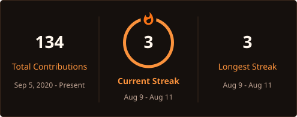

<h1 align="center">
  Hi, I'm Enzo Bittencourt!
  
</h1>

 

<!-- Typing SVG by DenverCoder1: https://github.com/DenverCoder1/readme-typing-svg -->

  

  
  
  
  

<samp>
I am a Software Engineering student focused on turning ideas, data and AI capabilities into practical software. I build back-end applications and applied AI projects with Python, TypeScript, REST APIs, LLMs and data tools. I am currently looking for internship and junior opportunities in software development, applied AI or data.
</samp>

## 🎓 Academic & Professional

<table>
  <tr>
    <td width="50%" valign="top">
      <h3>🎓 Education</h3>
      
Software Engineering student at Universidade de Vassouras, building a strong foundation in software development, data and intelligent systems.

    </td>
    <td width="50%" valign="top">
      <h3>💼 Experience</h3>
      
Experience as a Generalist AI Trainer, working with code-focused tasks, technical evaluation and AI safety requirements.

    </td>
  </tr>
</table>

## 🔥 Streak Stats

  

## 🛠️ My Favorite Tools

### 👨‍💻 Programming and Markup Languages

  
  
  
  
  
  
  
  

### 🧰 Frameworks, AI and Libraries

  
  
  
  
  
  
  
  

### 🗄️ Databases and Infrastructure

  
  
  
  
  

### 💻 Software and Workflow

  
  
  
  
  
  
  

## 🚀 Selected Projects

<table>
  <tr>
    <td width="50%" valign="top">
      <h3><a href="https://github.com/ecob5/RAG_document_assistant">📄 RAG Document Assistant</a></h3>
      
REST API that processes PDF and TXT files, creates embeddings and retrieves relevant context to answer questions with an LLM.

      
<code>Python</code> <code>RAG</code> <code>Embeddings</code> <code>REST API</code>

    </td>
    <td width="50%" valign="top">
      <h3><a href="https://github.com/ecob5/local-coding-agent">🤖 Local Coding Agent</a></h3>
      
Terminal agent that uses an OpenAI-compatible API and tool calling to inspect files, edit code and run project commands.

      
<code>Python</code> <code>LLMs</code> <code>Tool Calling</code>

    </td>
  </tr>
  <tr>
    <td width="50%" valign="top">
      <h3><a href="https://github.com/ecob5/copa2026">⚽ Copa 2026 API</a></h3>
      
Django REST Framework API for managing national teams and players, containerized with Docker.

      
<code>Django REST</code> <code>Docker</code> <code>API</code>

    </td>
    <td width="50%" valign="top">
      <h3><a href="https://github.com/ecob5/SGTA">🎓 Academic Events Portal</a></h3>
      
Web application developed for managing and publishing academic events.

      
<code>Web</code> <code>Academic Project</code>

    </td>
  </tr>
</table>

## 📊 GitHub Stats

  
💻 GitHub Profile Stats

   
  

    
    
  

  
<b>Note:</b> Top languages reflect the public code on this profile, not overall experience or proficiency.

  
⚡ Recent GitHub Activity

   
  

    
  

## 🙋‍♂️ Let's Connect

  
  
  

