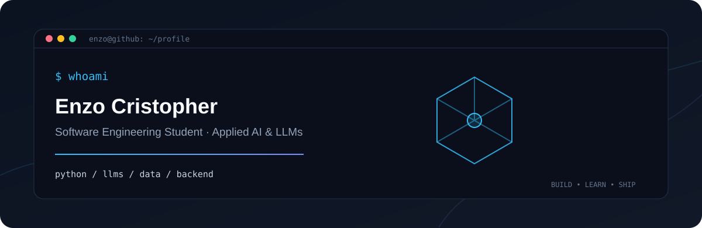
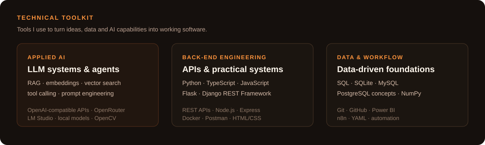

  
  
  

## About

I am a **Software Engineering student** building practical software with **Python, APIs, data and applied AI**. My current focus is on LLM-powered systems, RAG, agent workflows, model quality and automation — while keeping a solid foundation in back-end development.

I am looking for an internship or junior opportunity where I can contribute, learn quickly and build reliable products.

  

## Selected work

<table>
  <tr>
    <td width="50%">
      <h3>RAG Document Assistant</h3>
      
Document-question-answering assistant that uses Retrieval-Augmented Generation to make uploaded information searchable and useful through natural-language queries.

      
<a href="https://github.com/ecob5/RAG_document_assistant">View repository →</a>

    </td>
    <td width="50%">
      <h3>LLM Coding Agent</h3>
      
Python agent experiment using tool calling and API integration to inspect files, edit code and run commands in a local development workflow.

      
<em>Currently building</em>

    </td>
  </tr>
  <tr>
    <td width="50%">
      <h3>Intelligent Facial Presence System</h3>
      
Flask and OpenCV system for facial-presence management, with an SQLite database, dashboard, reports and data export. Presented to the Prefeitura Municipal de Vassouras.

    </td>
    <td width="50%">
      <h3>2026 World Cup API</h3>
      
Django REST Framework API for managing national teams and players, packaged with Docker and tested with Postman.

    </td>
  </tr>
</table>

  

## Beyond code

- **Generalist AI Trainer** — work involving model evaluation, prompt and code evaluation, and AI safety guidelines.
- **Software Engineering, 6th semester** — Universidade de Vassouras.
- Working with local models and developer tools including **LM Studio, Qwen, Gemma, ChatGPT, Codex and Claude Code**.

  <i>Building useful systems, learning in public and improving with every project.</i>

